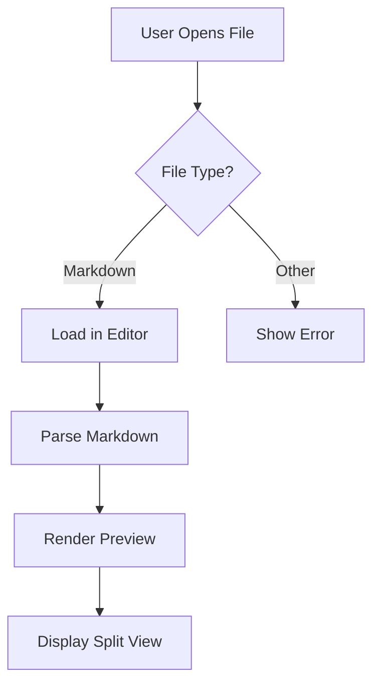

# Advanced Markdown Features

This document showcases advanced markdown capabilities including code blocks, tables, and GitHub-flavored markdown extensions.

## Code Blocks

### JavaScript Example
```javascript
function createMarkdownEditor() {
  const editor = new MonacoEditor({
    language: 'markdown',
    theme: 'vs-dark',
    wordWrap: 'on',
    automaticLayout: true
  });
  
  return editor;
}

// Event listener for live preview
editor.onDidChangeModelContent(() => {
  updatePreview(editor.getValue());
});
```

### Python Example
```python
import markdown
from pathlib import Path

def process_markdown_file(file_path):
    """Process a markdown file and return HTML."""
    content = Path(file_path).read_text()
    
    # Convert markdown to HTML
    html = markdown.markdown(content, extensions=[
        'tables',
        'codehilite',
        'fenced_code'
    ])
    
    return html
```

### SQL Example
```sql
-- Create a table for storing markdown documents
CREATE TABLE documents (
    id SERIAL PRIMARY KEY,
    title VARCHAR(255) NOT NULL,
    content TEXT NOT NULL,
    created_at TIMESTAMP DEFAULT CURRENT_TIMESTAMP,
    updated_at TIMESTAMP DEFAULT CURRENT_TIMESTAMP
);

-- Insert sample data
INSERT INTO documents (title, content) 
VALUES ('Welcome', '# Hello World\n\nThis is my first document.');
```

## Tables

| Feature | Basic Editor | Our Editor | Premium Editor |
|---------|-------------|------------|----------------|
| Syntax Highlighting | ❌ | ✅ | ✅ |
| Live Preview | ❌ | ✅ | ✅ |
| File Management | ❌ | ✅ | ✅ |
| Export to PDF | ❌ | ✅ | ✅ |
| Themes | ❌ | ⚠️ | ✅ |
| Collaboration | ❌ | ❌ | ✅ |
| Price | Free | Free | $9.99/mo |

### Performance Comparison

| Metric | Value | Status |
|--------|-------|--------|
| Startup Time | 0.5s | 🟢 Fast |
| Memory Usage | 85MB | 🟡 Moderate |
| File Load Time | 0.1s | 🟢 Fast |
| Export Speed | 2.3s | 🟢 Fast |

## Mathematical Expressions

Inline math: The quadratic formula is $x = \frac{-b \pm \sqrt{b^2-4ac}}{2a}$

Block math:
$$
\int_{-\infty}^{\infty} e^{-x^2} dx = \sqrt{\pi}
$$

## Mermaid Diagrams



## Footnotes

Here's a sentence with a footnote[^1]. And here's another one[^2].

## Definition Lists

Term 1
:   Definition for term 1

Term 2
:   Definition for term 2
:   Another definition for term 2

## Emoji Support

Common emoji: 😀 😍 🚀 💡 ⚡ 🔥 💻 📝 ✅ ❌

Technical emoji: 🐛 🔧 ⚙️ 🛠️ 🔍 📊 📈 💾

[^1]: This is the first footnote.
[^2]: This is the second footnote with more details.